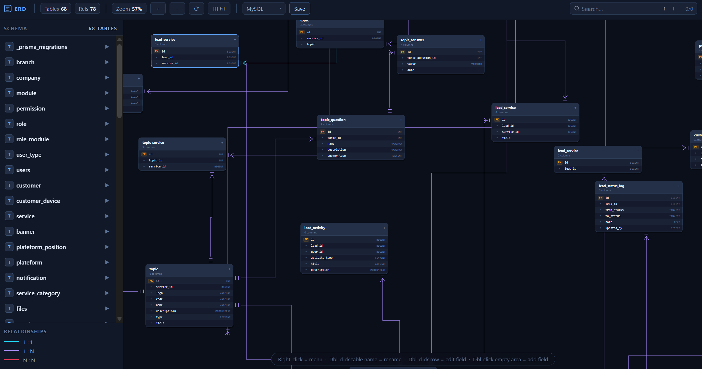

# Light Vuerd

Light Vuerd is a lightweight VS Code extension for viewing Vuerd ERD JSON files directly inside VS Code.

It opens `.json` / `.vuerd.json` files in an interactive ERD panel with draggable tables, zooming, panning, table search, and dashed relationship lines with cardinality markers.

## Features

- Open ERD JSON files from the VS Code Explorer context menu.
- View tables and columns in a dark interactive canvas.
- Drag tables to adjust the layout.
- Zoom with the mouse wheel or toolbar buttons.
- Pan with middle mouse or Space + drag.
- Search tables and columns with `Ctrl+F`.
- Navigate search results with `Enter` and `Shift+Enter`.
- Render relationship cardinality using one, optional, and many markers.
- Use dashed relationship lines for clearer visual separation.

## Screenshot

You can add an image of your screen here.

1. Create an `images` folder if it does not exist.
2. Add your screenshot as `images/screenshot.png`.
3. Replace this note with:

```md

```

## Usage

1. Open a workspace in VS Code.
2. Right-click a Vuerd JSON file in the Explorer.
3. Select `Light Vuerd: Open ERD`.
4. Use the toolbar or mouse controls to inspect the diagram.

## Keyboard And Mouse Controls

| Action | Control |
| --- | --- |
| Search table or column | `Ctrl+F` |
| Next search result | `Enter` |
| Previous search result | `Shift+Enter` |
| Clear search | `Esc` |
| Zoom | Mouse wheel |
| Pan | Middle mouse drag or Space + drag |
| Move table | Left mouse drag |
| Reset view | Toolbar `Reset` button |

